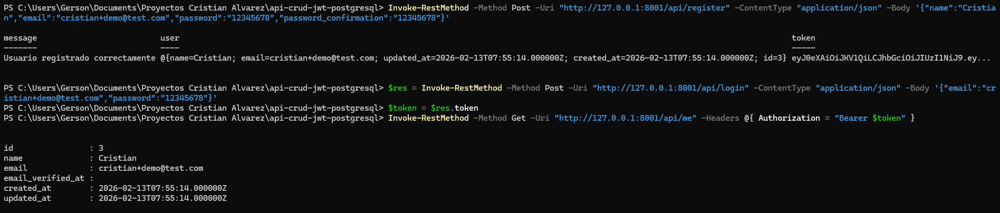

# API REST con JWT + PostgreSQL (Laravel)

API backend desarrollada con **Laravel 12**, utilizando **PostgreSQL** como base de datos y autenticación segura basada en **JWT (JSON Web Token)** mediante el paquete `tymon/jwt-auth`.

Este proyecto implementa autenticación stateless y rutas protegidas siguiendo buenas prácticas de desarrollo backend.

---

## Tecnologías Utilizadas

- Laravel 12
- PostgreSQL
- JWT (tymon/jwt-auth)
- Eloquent ORM
- Middleware `auth:api`
- Git & GitHub

---

## Funcionalidades

- Registro de usuario
- Login con generación de token JWT
- Obtención del usuario autenticado
- Logout
- Refresh token
- Protección de rutas mediante middleware
- Hash automático de contraseñas

---

## Instalación

### 1. Clonar e instalar dependencias

```bash
git clone https://github.com/cristian2005757/api-crud-jwt-postgresql.git
cd api-crud-jwt-postgresql
composer install
cp .env.example .env
php artisan key:generate
php artisan jwt:secret
```

### 2. Configurar Base de Datos

Configura tu archivo `.env` con PostgreSQL **antes** de ejecutar las migraciones:

```
DB_CONNECTION=pgsql
DB_HOST=127.0.0.1
DB_PORT=5432
DB_DATABASE=api_crud_jwt
DB_USERNAME=api_user
DB_PASSWORD=TU_PASSWORD
```

> Crea la base de datos `api_crud_jwt` y el usuario `api_user` en PostgreSQL antes de continuar.

### 3. Ejecutar migraciones e iniciar servidor

```bash
php artisan migrate
php artisan serve
```

Servidor disponible en: http://127.0.0.1:8000

---

## Screenshots

### JWT Authentication Flow


### Laravel Routes



---

## Endpoints

### Register

`POST /api/register`

Body JSON:

```json
{
  "name": "Cristian",
  "email": "cristian@test.com",
  "password": "12345678",
  "password_confirmation": "12345678"
}
```

---

### Login

`POST /api/login`

Body JSON:

```json
{
  "email": "cristian@test.com",
  "password": "12345678"
}
```

Respuesta esperada:

```json
{
  "message": "Login correcto",
  "token": "eyJ0eXAiOiJKV1QiLCJh...",
  "token_type": "bearer"
}
```

---

### Obtener Usuario Autenticado

`GET /api/me`

Header requerido:

```
Authorization: Bearer TU_TOKEN
```

---

### Logout

`POST /api/logout`

Header:

```
Authorization: Bearer TU_TOKEN
```

---

### Refresh Token

`POST /api/refresh`

Header:

```
Authorization: Bearer TU_TOKEN
```

---

## Seguridad

- Las contraseñas se almacenan hasheadas.
- Autenticación JWT stateless.
- Middleware protege rutas privadas.
- El archivo `.env` no se sube al repositorio.

---

## Autor

Cristian Alvarez  
Backend Developer Junior
